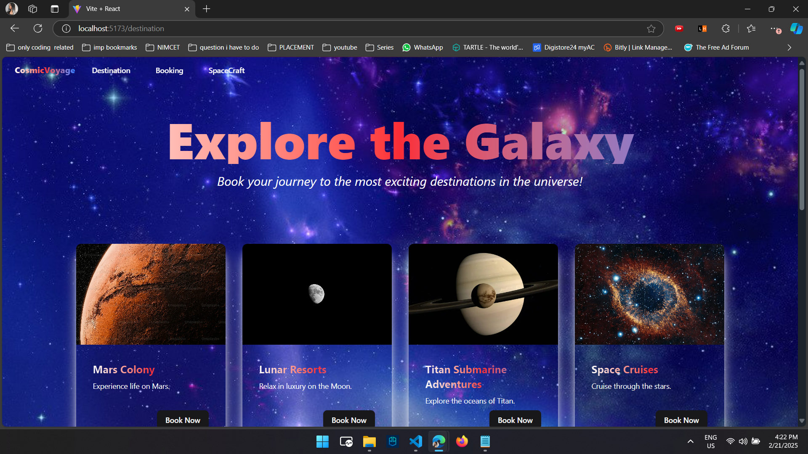
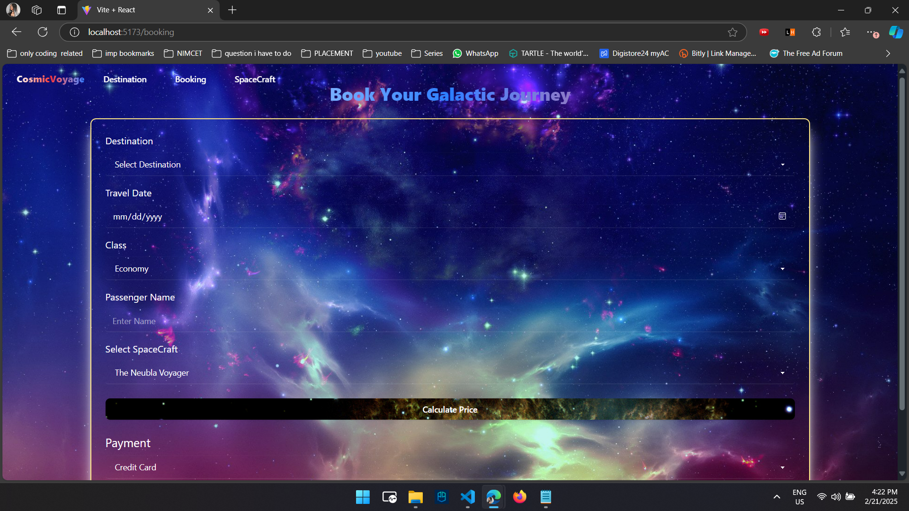
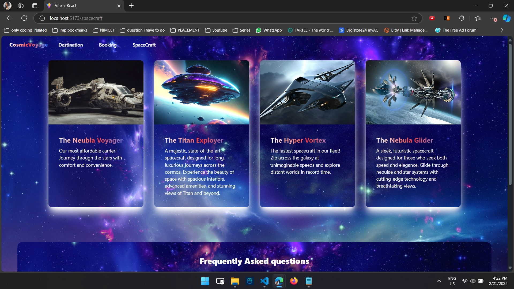

# ✨ CosmicVoyage - A Futuristic Space Travel Agency ✨

## Check the video for the brief of the project without running here  -> [Link](https://youtu.be/pAeTPGNqEBA) ⭐






## Technologies Used
- **Frontend**: React.js+vite
- **Styling**: Daisy Ui, Shadcn, and custom Tailwind CSS for responsive design
- **Version Control**: Git & GitHub


## Installation

### Step 1: Clone the Repository
```bash
git clone https://github.com/Neel-max-cpu/NsitHackthon.git
```


### Step 2: Navigate to the Project Directory
Change into the project directory:
```
cd frontend
```


### Step 3: Install Dependencies
Run the following command to install the necessary dependencies for the frontend and backend:
```shell
npm install
```
or 

```shell
npm i
```

### Start the app
Run the frontend 

```shell
npm run dev
```
